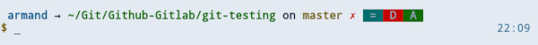

    

# Coldark - Zsh Theme

 

An optimized theme for web development that comes with two versions: light & dark.

## Presentation

[Coldark](https://github.com/ArmandPhilippot/coldark/) is a gray-blue theme. The colors used respect the Web Content Accessibility Guidelines (WCAG) in order to provide sufficient reading comfort.

It is recommended to use it with [Coldark for XFCE4 terminal](https://github.com/ArmandPhilippot/coldark-xfce4-terminal) so that the colors match those of Coldark.

## Colors

Coldark consists of three color palettes. The first is common to both versions. The other two each apply to a version.

Coldark uses 16 colors for each theme. However, the Coldark ZSH theme only uses 8 colors.

|  | Light Theme |  | Dark Theme |  |
| :-: | --- | :-: | --- | :-: |
| Denomination | Hex Code | Preview | Hex Code | Preview |
| `coldark00` | `#111b27` | ![#111b27][#111b27] | `#e3eaf2` | ![#e3eaf2][#e3eaf2] |
| `coldark07` | `#f0f4f8` | ![#f0f4f8][#f0f4f8] | `#0b121b` | ![#0b121b][#0b121b] |
| `coldark08` | `#006d6d` | ![#006d6d][#006d6d] | `#66cccc` | ![#66cccc][#66cccc] |
| `coldark09` | `#755f00` | ![#755f00][#755f00] | `#e6d37a` | ![#e6d37a][#e6d37a] |
| `coldark10` | `#005a8e` | ![#005a8e][#005a8e] | `#6cb8e6` | ![#6cb8e6][#6cb8e6] |
| `coldark11` | `#116b00` | ![#116b00][#116b00] | `#91d076` | ![#91d076][#91d076] |
| `coldark12` | `#af00af` | ![#af00af][#af00af] | `#f4adf4` | ![#f4adf4][#f4adf4] |
| `coldark15` | `#c70100` | ![#c70100][#c70100] | `#f57a73` | ![#f57a73][#f57a73] |

- **`coldark02`:** Used as foreground for Git status.
- **`coldark07`:** Used as foreground for indications (_on_, _arrow_).
- **`coldark08`:** Cyan. Used for unmerged.
- **`coldark09`:** Yellow. Used for prompt user (root, user) and modified elements.
- **`coldark10`:** Blue. Used for username, time and renamed elements.
- **`coldark11`:** Green. Used for current directory, clean Git repo and added elements.
- **`coldark12`:** Magenta. Used for untracked elements.
- **`coldark15`:** Red. Used for dirty Git repo and deleted elements.

## Features

Coldark Zsh Theme uses the Git feature of [Oh my Zsh](https://github.com/ohmyzsh/ohmyzsh). You can see the current branch and if your repo is clean or dirty (untracked, modified, ...). The theme also displays the time to the right of the prompt.

## Screenshots

These screenshots were taken with the Coldark for XFCE4 terminal theme.

| Light Theme | Dark Theme |
| :-: | :-: |
|  |  |

## Install & Activation

1. Place the theme in `~/.oh-my-zsh/custom/themes/`.
2. Edit `~/.zshrc` and replace `ZSH_THEME` value with `coldark` (e.g. `ZSH_THEME="coldark"`)
3. Reload ZSH config: `source ~/.zshrc`

## License

This project is open source and available under the [MIT License](https://github.com/ArmandPhilippot/coldark-zsh-theme/blob/master/LICENSE).

<!-- REFERENCES -->

<!-- UI Colors -->

[#f0f4f8]: https://placehold.it/20/f0f4f8/000000?text=+
[#e3eaf2]: https://placehold.it/20/e3eaf2/000000?text=+
[#d0dae7]: https://placehold.it/20/d0dae7/000000?text=+
[#8da1b9]: https://placehold.it/20/8da1b9/000000?text=+
[#3c526d]: https://placehold.it/20/3c526d/000000?text=+
[#213043]: https://placehold.it/20/213043/000000?text=+
[#111b27]: https://placehold.it/20/111b27/000000?text=+
[#0b121b]: https://placehold.it/20/0b121b/000000?text=+

<!-- Syntax - Light Theme Colors -->

[#c70100]: https://placehold.it/20/c70100/000000?text=+
[#116b00]: https://placehold.it/20/116b00/000000?text=+
[#755f00]: https://placehold.it/20/755f00/000000?text=+
[#005a8e]: https://placehold.it/20/005a8e/000000?text=+
[#af00af]: https://placehold.it/20/af00af/000000?text=+
[#006d6d]: https://placehold.it/20/006d6d/000000?text=+
[#7c00aa]: https://placehold.it/20/7c00aa/000000?text=+
[#a04900]: https://placehold.it/20/a04900/000000?text=+

<!-- Syntax - Dark Theme Colors -->

[#f57a73]: https://placehold.it/20/f57a73/000000?text=+
[#91d076]: https://placehold.it/20/91d076/000000?text=+
[#e6d37a]: https://placehold.it/20/e6d37a/000000?text=+
[#6cb8e6]: https://placehold.it/20/6cb8e6/000000?text=+
[#f4adf4]: https://placehold.it/20/f4adf4/000000?text=+
[#66cccc]: https://placehold.it/20/66cccc/000000?text=+
[#c699e3]: https://placehold.it/20/c699e3/000000?text=+
[#e9ae7e]: https://placehold.it/20/e9ae7e/000000?text=+
