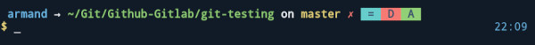

    

# Coldark - Zsh Theme

 

An optimized theme for web development that comes with two versions: light & dark.

## Presentation

[Coldark](https://github.com/ArmandPhilippot/coldark/) is a gray-blue theme. The colors used respect the Web Content Accessibility Guidelines (WCAG) in order to provide sufficient reading comfort.

It is recommended to use it with [Coldark for XFCE4 terminal](https://github.com/ArmandPhilippot/coldark-xfce4-terminal) so that the colors match those of Coldark.

## Colors

Coldark consists of three color palettes. The first is common to both versions. The other two each apply to a version.

Coldark uses 16 colors for each theme. However, the Coldark ZSH theme only uses 10 colors.

|                | Light Theme |                                                          | Dark Theme |                                                          |
| -------------- | ----------- | :------------------------------------------------------: | :--------: | :------------------------------------------------------: |
| **Usage code** | **Hex**     |                       **Preview**                        |  **Hex**   |                       **Preview**                        |
| `coldark02`    | `#ccd6e4`   |  | `#304259`  |  |
| `coldark03`    | `#304259`   |  | `#ccd6e4`  |  |
| `coldark06`    | `#213043`   |  | `#f0f3f8`  |  |
| `coldark07`    | `#f0f3f8`   |  | `#213043`  |  |
| `coldark08`    | `#007474`   |  | `#5dc2c2`  |  |
| `coldark09`    | `#7d6600`   |  | `#cdb74a`  |  |
| `coldark10`    | `#005c99`   |  | `#6ab3e4`  |  |
| `coldark11`    | `#237800`   |  | `#82c366`  |  |
| `coldark12`    | `#b800b8`   |  | `#ea89ea`  |  |
| `coldark15`    | `#bf0100`   |  | `#f57a73`  |  |

- **`coldark02`: Dark gray**  
  Used as foreground for Git indicators (if bold is bright checked).
- **`coldark03`: Light gray**  
  Used as foreground for text (if bold is bright unchecked).
- **`coldark06`: White**
  Used as foreground for text (if bold is bright checked).
- **`coldark07`: Black**
  Used as foreground for Git indicators (if bold is bright unchecked).
- **`coldark08`: Cyan**  
  Used as background for Git unmerged.
- **`coldark09`: Yellow**  
  Used as foreground for prompt indicator and git branch. Also used as background for Git changed.
- **`coldark10`: Blue**  
  Used as foreground for username and time. Also used as background for Git renamed.
- **`coldark11`: Green**  
  Used as foreground for current path and clean Git repo. Also used as background for Git added.
- **`coldark12`: Magenta**  
  Used as background for Git untracked.
- **`coldark15`: Red**  
  Used as foreground for dirty Git repo. Also used as background for Git deleted.

## Features

Coldark Zsh Theme uses the Git feature of [Oh my Zsh](https://github.com/ohmyzsh/ohmyzsh). You can see the current branch and if your repo is clean or dirty (untracked, modified, ...). The theme also displays the time to the right of the prompt.

## Screenshots

These screenshots were taken with the Coldark for XFCE4 terminal theme.

|                             Light Theme                              |                             Dark Theme                             |
| :------------------------------------------------------------------: | :----------------------------------------------------------------: |
|  |  |

## Install & Activation

1. Place the theme in `~/.oh-my-zsh/custom/themes/`.
2. Edit `~/.zshrc` and replace `ZSH_THEME` value with `coldark` (e.g. `ZSH_THEME="coldark"`)
3. Reload ZSH config: `source ~/.zshrc`

## License

This project is open source and available under the [MIT License](https://github.com/ArmandPhilippot/coldark-zsh-theme/blob/master/LICENSE).
